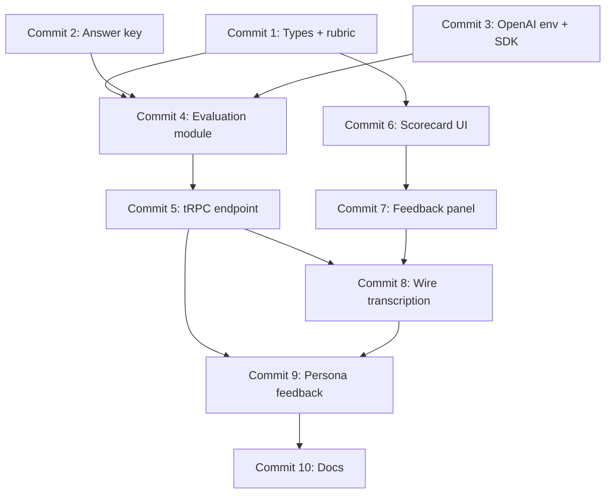

# GPT Feedback Feature — Commit Plan

Ordered commits for the **dev** branch. Each commit should build and typecheck on its own before moving to the next.

**Scope:** Evaluate the user's hazard talk transcript (from browser speech recognition after recording stops) against professor rubrics and the construction-site answer key, via a server-side OpenAI call. Display star-rated criteria and pinpointed missed items on the frontend.

**Out of scope for these commits:** AWS Transcribe, S3 audio upload, database persistence, auth.

**Reference materials (already in repo):**

- `public/safety-reference/` — professor PDFs (rubrics encoded as structured TS data, not parsed at runtime)
- `public/images/construction-site-demo.png` — demo scenario image
- `src/lib/demo-data.ts` — existing hazard labels for the same scenario

**Architecture choice:** Use a tRPC mutation (T3 convention) as the server endpoint that calls OpenAI. The API key stays server-side via `OPENAI_API_KEY` in `.env`.

---

## Commit 1 — Add feedback types and safety rubric criteria

**Goal:** Define shared types and static rubric data derived from the professor safety guides.

**Create / edit:**

| File | Purpose |
|------|---------|
| `src/types/feedback.ts` | Types for `RubricCriterion`, `CriterionRating` (1–5 stars), `MissedItem`, `SafetyTalkFeedback`, loading/error states |
| `src/lib/safety-rubric.ts` | Rubric criteria with IDs, labels, descriptions, and evaluation guidance mapped from: `High Quality Pre-Job Safety Meetings Guide 12.17.24.pdf`, `Pre job Scorecard- EEI updated.pdf`, `CSRA Training Safety Guide.pdf` |

**Suggested rubric categories (adjust during implementation to match PDFs):**

- Hazard identification completeness
- Control measures / corrective actions
- Communication clarity and structure
- Worker engagement and verification
- PPE and procedural expectations

**Git commands:**

```bash
git add src/types/feedback.ts src/lib/safety-rubric.ts
git commit -m "add feedback types and safety rubric criteria"
```

---

## Commit 2 — Add construction site scenario answer key

**Goal:** Add a scenario-specific “correct answer” the evaluator compares against. Tie it to the existing demo scenario and its five labeled hazards.

**Create / edit:**

| File | Purpose |
|------|---------|
| `src/lib/scenario-answer-keys.ts` | Answer key for `construction-site-demo`: scenario ID, title, each hazard (id, name, severity, what to call out, required controls), and a model summary paragraph |
| `src/lib/demo-data.ts` | Add `scenario.id` (e.g. `"construction-site-demo"`) so client and server share one identifier |

**Answer key should cover these hazards (from demo image / `hazardLabels`):**

1. Unprotected edge — guardrails, fall protection, stay back from edge
2. Suspended load — exclusion zone, tag lines, never walk under load, signal person
3. Unsecured ladder — 4:1 rule, tie-off, inspect before use
4. Spilled materials / trip hazard — cleanup, signage, housekeeping
5. Missing PPE — hard hat, hi-vis, task-appropriate PPE

**Git commands:**

```bash
git add src/lib/scenario-answer-keys.ts src/lib/demo-data.ts
git commit -m "add construction site scenario answer key"
```

---

## Commit 3 — Configure OpenAI environment and SDK

**Goal:** Validate `OPENAI_API_KEY` at startup and add the OpenAI client dependency.

**Create / edit:**

| File | Purpose |
|------|---------|
| `src/env.js` | Add `OPENAI_API_KEY: z.string().min(1)` to `server` schema and `runtimeEnv` |
| `.env.example` | Document `OPENAI_API_KEY=` placeholder (no real key) |
| `package.json` | Add `openai` dependency |
| `package-lock.json` | Lockfile from `npm install openai` |

**Local setup (not committed):** Add your real key to `.env`:

```bash
OPENAI_API_KEY=sk-...
```

**Git commands:**

```bash
git add src/env.js .env.example package.json package-lock.json
git commit -m "configure OpenAI environment and SDK"
```

---

## Commit 4 — Add server-side safety talk evaluation module

**Goal:** Build the prompt, Zod response schema, and OpenAI call. No tRPC yet — unit-testable server module.

**Create:**

| File | Purpose |
|------|---------|
| `src/server/evaluation/feedback-schema.ts` | Zod schema for structured GPT output: `criteria` (id, stars 1–5, summary), `missedItems[]`, `overallSummary`, optional `personaFeedback[]` |
| `src/server/evaluation/build-evaluation-prompt.ts` | Assemble system + user messages from transcript, rubric, answer key, scenario metadata |
| `src/server/openai/evaluate-safety-talk.ts` | Call OpenAI (e.g. `gpt-4o-mini` with JSON schema / `response_format`), parse and validate with Zod, map errors cleanly |

**Prompt requirements:**

- Instruct model to score each rubric criterion with 1–5 stars
- Compare transcript to answer key hazards and controls
- List specific missed hazards, controls, or communication gaps
- Use plain language suitable for a trainee scorecard

**Git commands:**

```bash
git add src/server/evaluation/feedback-schema.ts src/server/evaluation/build-evaluation-prompt.ts src/server/openai/evaluate-safety-talk.ts
git commit -m "add server-side safety talk evaluation module"
```

---

## Commit 5 — Add tRPC feedback evaluation endpoint

**Goal:** Expose evaluation to the client through tRPC.

**Create / edit:**

| File | Purpose |
|------|---------|
| `src/server/api/routers/feedback.ts` | `evaluate` mutation: input `{ scenarioId, transcript }`, output `SafetyTalkFeedback`; validate non-empty transcript; load answer key by scenario ID |
| `src/server/api/root.ts` | Register `feedback: feedbackRouter` |

**Input validation:**

- `scenarioId`: string (must match a known answer key)
- `transcript`: string, min length (e.g. 10 chars)

**Git commands:**

```bash
git add src/server/api/routers/feedback.ts src/server/api/root.ts
git commit -m "add tRPC feedback evaluation endpoint"
```

---

## Commit 6 — Add scorecard and star rating UI components

**Goal:** Presentable feedback UI before wiring API calls.

**Create:**

| File | Purpose |
|------|---------|
| `src/components/demo/StarRating.tsx` | Read-only 1–5 star display (filled / empty stars, accessible label) |
| `src/components/demo/FeedbackScorecard.tsx` | Scorecard card: overall summary, per-criterion stars + text, missed-items list with severity styling |

**Design notes:**

- Match existing slate / `#1e4a8c` training-tool aesthetic
- Show empty / placeholder state when no feedback yet
- Support `isLoading` skeleton or spinner prop

**Git commands:**

```bash
git add src/components/demo/StarRating.tsx src/components/demo/FeedbackScorecard.tsx
git commit -m "add scorecard and star rating UI components"
```

---

## Commit 7 — Replace feedback preview with scorecard panel

**Goal:** Swap the “coming soon” placeholder for the real scorecard component (still driven by props, not yet wired to tRPC).

**Edit:**

| File | Purpose |
|------|---------|
| `src/components/demo/FeedbackPreview.tsx` | Render `FeedbackScorecard` with props: `feedback`, `isLoading`, `error` |
| `src/app/page.tsx` | Lift `feedback` / `isLoading` / `error` state (initially null) and pass to `FeedbackPreview` |

**Git commands:**

```bash
git add src/components/demo/FeedbackPreview.tsx src/app/page.tsx
git commit -m "replace feedback preview with scorecard panel"
```

---

## Commit 8 — Wire get feedback action in transcription panel

**Goal:** Connect “Get Feedback” to the tRPC mutation after the user stops recording and has a transcript.

**Edit:**

| File | Purpose |
|------|---------|
| `src/components/demo/TranscriptionPanel.tsx` | On “Get Feedback”: call `api.feedback.evaluate.useMutation()` with `scenario.id` + transcript; expose `onFeedbackRequest` / `onFeedbackResult` callbacks or accept mutation handlers from parent |
| `src/app/page.tsx` | Pass handlers to update scorecard state; disable button while recording or when transcript is empty; show loading on scorecard during request |

**UX rules:**

- Button enabled only when `!isRecording && transcript.trim().length > 0`
- Clear previous feedback when user starts a new recording (optional but recommended)
- Surface API errors in the scorecard panel

**Git commands:**

```bash
git add src/components/demo/TranscriptionPanel.tsx src/app/page.tsx
git commit -m "wire get feedback action in transcription panel"
```

---

## Commit 9 — Display persona-specific feedback from evaluation

**Goal:** Extend the evaluation response and persona panel so worker listeners show tailored reactions, not just “Listening”.

**Edit:**

| File | Purpose |
|------|---------|
| `src/server/evaluation/feedback-schema.ts` | Ensure `personaFeedback` includes `personaId`, `reaction`, `understood` (or similar) |
| `src/server/evaluation/build-evaluation-prompt.ts` | Ask GPT for brief persona-specific reactions referencing `workerPersonas` from demo data |
| `src/components/demo/PersonaListeners.tsx` | Accept optional `personaFeedback` prop; after evaluation, show quote/reaction per persona instead of static “Listening” |
| `src/app/page.tsx` | Pass persona feedback from evaluation result to `PersonaListeners` |

**Git commands:**

```bash
git add src/server/evaluation/feedback-schema.ts src/server/evaluation/build-evaluation-prompt.ts src/components/demo/PersonaListeners.tsx src/app/page.tsx
git commit -m "display persona-specific feedback from evaluation"
```

---

## Commit 10 — Document GPT feedback feature and manual test steps

**Goal:** Capture how to run and verify the feature for the team.

**Edit:**

| File | Purpose |
|------|---------|
| `docs/gpt-feedback.md` | Env setup, rubric/answer-key sources, manual test script, expected UI behavior |
| `docs/implementation-plan.md` | Mark Phase 6 partial progress (local GPT evaluation without DB) |

**Git commands:**

```bash
git add docs/gpt-feedback.md docs/implementation-plan.md
git commit -m "document GPT feedback feature and manual test steps"
```

---

## Dependency graph



---

## Manual verification checklist (after Commit 8+)

1. Set `OPENAI_API_KEY` in `.env` and run `npm run dev`
2. Open the assessment page, click **Start Talking**, describe some (not all) hazards, click **Stop**
3. Click **Get Feedback** — scorecard shows loading, then star ratings per criterion
4. Confirm missed hazards/controls appear when omitted from the talk
5. After Commit 9 — each persona shows a distinct reaction tied to the evaluation

---

## Notes for implementers

- **Transcript vs audio:** The demo uses browser speech recognition text, not an audio blob. The GPT call sends the transcript. Raw audio → Transcribe remains a later phase.
- **PDF rubrics:** Encode criteria in `safety-rubric.ts`; do not parse PDFs at runtime in the MVP.
- **Cost / model:** Start with `gpt-4o-mini` for development; upgrade model in `evaluate-safety-talk.ts` if scoring quality is insufficient.
- **Structured output:** Prefer OpenAI JSON schema / `response_format: { type: "json_schema" }` plus Zod validation to avoid brittle free-text parsing.
