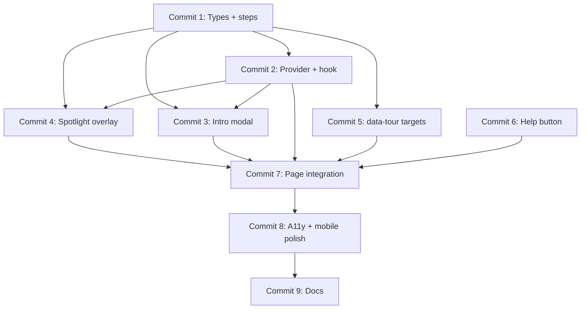

# Help Walkthrough / Interactive Tutorial — Commit Plan

Ordered commits for the **dev** branch. Each commit should pass `npm run typecheck` on its own before moving to the next.

**Scope:** Wire the **Help** button in `AppHeader` to launch a two-phase interactive tutorial — (A) intro modal slides explaining SafeTalk, then (B) a spotlight page tour highlighting the four main assessment sections.

**Out of scope for these commits:** Dashboard / Reports / Settings nav, backend / tRPC changes, new scenarios, `localStorage` auto-skip on return, auto-launch on first visit.

**Reference materials (already in repo):**

- `docs/plan.md` — commit-plan template used for GPT feedback
- `docs/gpt-feedback.md` — assessment flow the tutorial should explain
- `src/app/page.tsx` — assessment page layout (`lg:grid-cols-[minmax(0,1fr)_320px]`, personas `row-span-2`)
- `.cursor/rules/project.mdc` — MVP scope, styling conventions

**Architecture choice:** Lightweight custom tutorial (no tour library). Step definitions in `src/lib/tutorial-steps.ts`, orchestration via `TutorialProvider` + `useTutorial()`, spotlight positioning via `getBoundingClientRect()` with resize/scroll listeners. Stable `data-tour` attributes on target components — no fragile DOM selectors.

**Styling:** Match existing slate / `#1e4a8c` training-tool aesthetic. Use shadcn `Button` / `Card`, `lucide-react` icons (already installed — no new npm packages).

---

## Commit 1 — Add tutorial types and step configuration

**Goal:** Define shared types and static step content for intro slides and spotlight tour steps.

**Create:**

| File | Purpose |
|------|---------|
| `src/types/tutorial.ts` | `TutorialPhase` (`"closed" \| "intro" \| "spotlight"`), `IntroSlide`, `SpotlightStep`, `TutorialStep` union, `TutorialState`, `data-tour` target IDs |
| `src/lib/tutorial-steps.ts` | `INTRO_SLIDES` (4 slides) and `SPOTLIGHT_STEPS` (4 steps) with `id`, `title`, `body`, `target` (`"scenario" \| "transcription" \| "personas" \| "scorecard"`), optional `howToUse` copy |

**Intro slide content (adjust copy during implementation):**

1. **Welcome** — SafeTalk is a workplace hazard communication assessment tool for supervisors / project managers
2. **The goal** — Identify hazards on the jobsite, explain controls, communicate clearly to workers
3. **The flow** — Scenario → record/type your talk → AI worker listeners react → star-rated scorecard
4. **Ready** — “Tour the page” CTA to begin spotlight phase

**Spotlight steps (order):**

| Step | `data-tour` | Summary |
|------|-------------|---------|
| 1 | `scenario` | Construction scenario image; colored hazard labels; review hazards before speaking |
| 2 | `transcription` | Start Talking / Stop; live transcript; type if mic unavailable; Get Feedback when done |
| 3 | `personas` | Five AI worker personas listening; show reactions after feedback |
| 4 | `scorecard` | Star-rated rubric scores, missed items, overall summary |

**Git commands:**

```bash
git add src/types/tutorial.ts src/lib/tutorial-steps.ts
git commit -m "add tutorial types and step configuration"
```

---

## Commit 2 — Add tutorial state hook and provider

**Goal:** Centralize tutorial open/close, phase transitions, and step navigation. No UI yet — provider exports context only.

**Create:**

| File | Purpose |
|------|---------|
| `src/hooks/use-tutorial.ts` | `useTutorial()` — read/write context; throws if used outside provider |
| `src/components/tutorial/TutorialProvider.tsx` | Context provider: `phase`, `introIndex`, `spotlightIndex`, `open()`, `close()`, `skip()`, `next()`, `back()`, `startSpotlight()`; resets indices on open |

**State rules:**

- `open()` → `phase: "intro"`, `introIndex: 0`
- Last intro slide `next()` or `startSpotlight()` → `phase: "spotlight"`, `spotlightIndex: 0`
- Last spotlight `next()` or explicit `finish()` → `close()` (`phase: "closed"`)
- `close()` / `skip()` → `phase: "closed"`, reset indices
- `back()` no-op on first slide of each phase

**Git commands:**

```bash
git add src/hooks/use-tutorial.ts src/components/tutorial/TutorialProvider.tsx
git commit -m "add tutorial state hook and provider"
```

---

## Commit 3 — Add intro modal with dimmed backdrop and slide navigation

**Goal:** Phase A UI — centered modal over full-screen dimmed overlay; multi-slide navigation.

**Create:**

| File | Purpose |
|------|---------|
| `src/components/tutorial/TutorialIntroModal.tsx` | Fixed overlay (`bg-black/60`, `pointer-events-auto`); centered `Card`; slide content from `INTRO_SLIDES`; infographic visuals per slide (step numbers, lucide icons, simple Tailwind diagram); **Next** / **Back** (hidden on slide 1); final slide **Tour the page**; **Skip tutorial** link + **Close (X)**; `aria-modal`, `role="dialog"`, labelled title |

**Props:** Driven by `useTutorial()` or explicit props (`isOpen`, `slideIndex`, handlers) — provider integration comes in Commit 7.

**Git commands:**

```bash
git add src/components/tutorial/TutorialIntroModal.tsx
git commit -m "add intro modal with dimmed backdrop and slide navigation"
```

---

## Commit 4 — Add spotlight overlay and step tooltip card

**Goal:** Phase B UI — dim page, highlight one section at a time, show tooltip card with step copy and navigation.

**Create:**

| File | Purpose |
|------|---------|
| `src/components/tutorial/TutorialSpotlight.tsx` | Full-screen fixed overlay with SVG or box-shadow cutout around `[data-tour="${target}"]` rect; ring highlight (`ring-2 ring-[#1e4a8c]`); tooltip `Card` positioned near target (flip below/above/center on small screens); **Next** / **Back** / **Finish** on last step; `resize` + `scroll` listeners to update rect; `pointer-events-none` on dim layer, `pointer-events-auto` on card + nav only |

**Positioning notes:**

- Query `document.querySelector('[data-tour="…"]')` for current step target
- On mobile / cramped layout: center tooltip card, still show ring if target visible or fallback to full-width centered card without cutout

**Git commands:**

```bash
git add src/components/tutorial/TutorialSpotlight.tsx
git commit -m "add spotlight overlay and step tooltip card"
```

---

## Commit 5 — Add data-tour targets to assessment section components

**Goal:** Stable anchors for spotlight positioning on the four tour targets.

**Edit:**

| File | Change |
|------|--------|
| `src/components/demo/ScenarioViewer.tsx` | Add `data-tour="scenario"` on root `Card` |
| `src/components/demo/TranscriptionPanel.tsx` | Add `data-tour="transcription"` on root `Card` |
| `src/components/demo/PersonaListeners.tsx` | Add `data-tour="personas"` on root `Card` |
| `src/components/demo/FeedbackScorecard.tsx` | Add `data-tour="scorecard"` on root `Card` |

**Git commands:**

```bash
git add src/components/demo/ScenarioViewer.tsx src/components/demo/TranscriptionPanel.tsx src/components/demo/PersonaListeners.tsx src/components/demo/FeedbackScorecard.tsx
git commit -m "add data-tour targets to assessment section components"
```

---

## Commit 6 — Enable Help button in AppHeader

**Goal:** Make only the Help nav item interactive; accept an `onHelpClick` callback from the page.

**Edit:**

| File | Change |
|------|--------|
| `src/components/demo/AppHeader.tsx` | Add optional `onHelpClick?: () => void`; enable **Help** button when callback provided (`disabled={!onHelpClick}` for Help only; other nav items stay disabled); `aria-label="Open help tutorial"` |

**Git commands:**

```bash
git add src/components/demo/AppHeader.tsx
git commit -m "enable help button in app header"
```

---

## Commit 7 — Integrate tutorial on assessment page

**Goal:** Mount provider, intro modal, spotlight, and wire Help → open tutorial. Full intro → spotlight → close flow.

**Edit:**

| File | Change |
|------|--------|
| `src/app/page.tsx` | Wrap content in `TutorialProvider`; render `TutorialIntroModal` + `TutorialSpotlight` (portals or siblings); pass `onHelpClick={() => open()}` to `AppHeader`; conditionally render modal when `phase === "intro"`, spotlight when `phase === "spotlight"` |

**UX rules:**

- Page not interactive behind intro modal (overlay captures clicks)
- Intro final slide **Tour the page** calls `startSpotlight()`
- Spotlight last step **Finish** calls `close()`
- Skip / X at any time calls `close()`

**Git commands:**

```bash
git add src/app/page.tsx src/components/tutorial/TutorialProvider.tsx src/components/tutorial/TutorialIntroModal.tsx src/components/tutorial/TutorialSpotlight.tsx
git commit -m "integrate tutorial on assessment page"
```

---

## Commit 8 — Polish tutorial accessibility and mobile behavior

**Goal:** Keyboard support, focus management, scroll targets into view, graceful mobile degradation.

**Edit:**

| File | Change |
|------|--------|
| `src/components/tutorial/TutorialIntroModal.tsx` | `Escape` closes; focus trap while open (focus first focusable on open, restore on close); `aria-labelledby` / `aria-describedby` |
| `src/components/tutorial/TutorialSpotlight.tsx` | `Escape` closes; `scrollIntoView({ block: "nearest", behavior: "smooth" })` when step changes; mobile: centered tooltip when viewport &lt; `lg` or target rect too small |
| `src/components/tutorial/TutorialProvider.tsx` | Optional `useEffect` to lock `document.body` overflow while tutorial open |

**Git commands:**

```bash
git add src/components/tutorial/TutorialIntroModal.tsx src/components/tutorial/TutorialSpotlight.tsx src/components/tutorial/TutorialProvider.tsx
git commit -m "polish tutorial accessibility and mobile behavior"
```

---

## Commit 9 — Document help walkthrough feature

**Goal:** Capture architecture, step content, and manual test script for the team.

**Create / edit:**

| File | Purpose |
|------|---------|
| `docs/tutorial.md` | Feature overview, file map, intro + spotlight phases, how to extend steps, manual test checklist |
| `docs/gpt-feedback.md` | Add short “Help tutorial” section linking to `docs/tutorial.md` |
| `docs/implementation-plan.md` | Note help walkthrough MVP progress |

**Git commands:**

```bash
git add docs/tutorial.md docs/gpt-feedback.md docs/implementation-plan.md
git commit -m "document help walkthrough feature"
```

---

## Dependency graph



---

## Manual verification checklist (after Commit 7+)

1. Run `npm run dev` and open the assessment page
2. Confirm Dashboard / Reports / Settings nav buttons remain disabled; **Help** is enabled
3. Click **Help** — dimmed overlay appears; intro modal centered; page behind not clickable
4. Walk through intro slides with **Next** / **Back**; visuals render on each slide
5. On final intro slide, click **Tour the page** — modal closes, spotlight phase begins on scenario section
6. Advance through all four spotlight steps; each highlights the correct `data-tour` section with title + how-to copy
7. Click **Finish** on last step — overlay clears, normal page interaction restored
8. Re-open tutorial; click **Skip tutorial** or **X** mid-flow — tutorial dismisses immediately
9. After Commit 8 — press **Escape** during intro and spotlight; focus stays trapped in modal; spotlight scrolls scorecard into view on step 4
10. Resize to mobile width — intro modal remains usable; spotlight shows centered card without broken layout
11. Run `npm run typecheck` — passes

---

## Notes for implementers

- **No new libraries:** Spotlight cutout can use an SVG mask or four positioned divs + `box-shadow: 0 0 0 9999px rgba(0,0,0,0.6)` on the highlight ring. Prefer the box-shadow ring technique for simplicity.
- **Persona count:** Tour copy should say “five AI worker personas” to match `workerPersonas` in `demo-data.ts`.
- **FeedbackPreview vs FeedbackScorecard:** Put `data-tour="scorecard"` on `FeedbackScorecard` (the visible card); `FeedbackPreview` is a thin wrapper.
- **Optional later:** `localStorage` key `safetalk-tutorial-completed` and auto-open on first visit — separate commit after MVP if requested.
- **Commit workflow:** Implement one commit at a time; run `npm run typecheck` before reporting; wait for user confirmation before the next commit; only `git commit` when the user asks.
